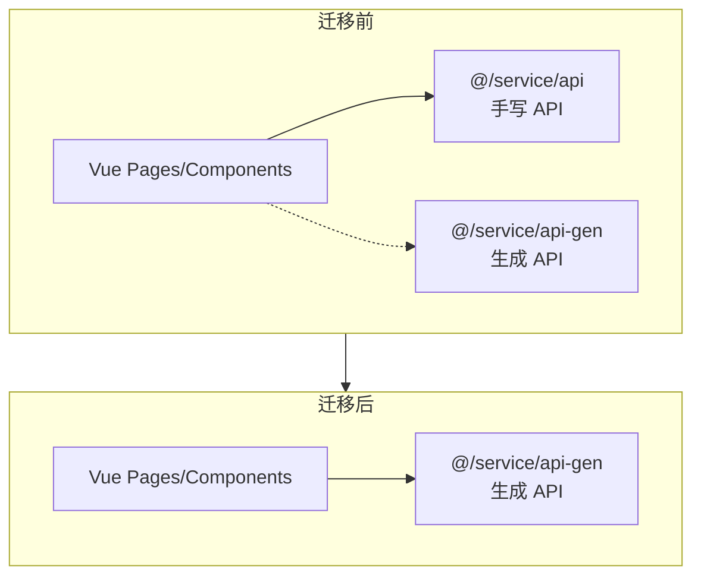

# Design Document: API Migration Completion

## Overview

本设计文档描述了将前端项目中所有页面直接使用 `@/service/api-gen` 生成的 API 函数的方案。迁移完成后，删除旧的 `@/service/api` 目录，实现统一的类型安全 API 调用。

## Architecture



## Components and Interfaces

### 生成的 API 函数

所有 API 函数从 `@/service/api-gen` 导入：

```typescript
// 导入示例
import {
  mainControllerLogin,
  mainControllerCaptchaImage,
  mainControllerGetRouters,
  userControllerFindAll,
  menuControllerFindAll,
  dictControllerFindOneDataType,
} from '@/service/api-gen';
```

### API 调用方式

生成的 API 使用 options 对象传参：

```typescript
// 无参数调用
const result = await mainControllerCaptchaImage();

// 带 query 参数
const result = await userControllerFindAll({
  query: { pageNum: 1, pageSize: 10 }
});

// 带 path 参数
const result = await menuControllerFindOne({
  path: { menuId: '1' }
});

// 带 body 参数
const result = await mainControllerLogin({
  body: { userName, password, code, uuid }
});
```

### 响应数据处理

生成的 API 返回完整响应对象，需要从 `data` 属性获取业务数据：

```typescript
const response = await mainControllerCaptchaImage();
const { img, uuid, captchaEnabled } = response.data;
```

## Data Models

### 类型定义

所有类型从 `@/service/api-gen` 导入：

```typescript
import type {
  LoginDto,
  CreateUserDto,
  UpdateUserDto,
  ListUserDto,
} from '@/service/api-gen';
```

## Correctness Properties

*A property is a characteristic or behavior that should hold true across all valid executions of a system-essentially, a formal statement about what the system should do. Properties serve as the bridge between human-readable specifications and machine-verifiable correctness guarantees.*

### Property 1: No Legacy API Imports

*For any* TypeScript/Vue file in the project, there should be no import statements from `@/service/api` or `@/service/api/system`.

**Validates: Requirements 7.1**

## Error Handling

| Error Type | Condition | Handling |
|------------|-----------|----------|
| TypeScript Error | 类型不匹配 | 修复类型定义或调整调用方式 |
| Runtime Error | API 调用失败 | 保持现有错误处理逻辑 |
| Import Error | 找不到 API 函数 | 检查生成的 API 是否包含该函数 |

## Testing Strategy

### 验证方法

1. **静态检查** - 使用 grep 搜索确认无旧 API 导入
2. **TypeScript 编译** - 运行 `pnpm typecheck` 确保类型正确
3. **功能测试** - 手动测试各页面功能正常

### 验证命令

```bash
# 检查是否还有旧 API 导入
grep -r "from '@/service/api'" admin-naive-ui/src --include="*.vue" --include="*.ts"

# TypeScript 类型检查
cd admin-naive-ui && pnpm typecheck
```

