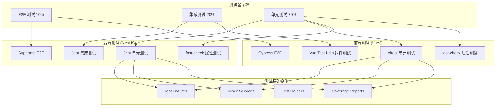

# Design Document: 企业级测试标准

## Overview

本设计文档定义了企业级测试标准的技术架构和实现方案。该方案覆盖后端（NestJS + Jest）和前端（Vue3 + Vitest + Cypress）的完整测试体系，包括单元测试、集成测试、E2E测试、属性测试等多种测试类型。

### 设计目标

1. 建立统一的测试覆盖率标准
2. 实现测试金字塔架构
3. 集成属性测试（Property-Based Testing）
4. 标准化测试数据管理
5. 建立 Mock 和 Stub 标准
6. 支持持续集成测试流程

## Architecture

### 整体架构图



### 目录结构

```
project/
├── server/                          # 后端项目
│   ├── test/
│   │   ├── unit/                    # 单元测试
│   │   │   ├── config/
│   │   │   ├── core/
│   │   │   ├── infrastructure/
│   │   │   ├── module/
│   │   │   ├── security/
│   │   │   ├── shared/
│   │   │   └── tenant/
│   │   ├── integration/             # 集成测试
│   │   ├── e2e/                     # E2E 测试
│   │   ├── fixtures/                # 测试数据工厂
│   │   ├── mocks/                   # Mock 实现
│   │   └── helpers/                 # 测试辅助函数
│   └── jest.config.js
│
└── admin-naive-ui/                  # 前端项目
    ├── test/
    │   ├── unit/                    # 单元测试
    │   │   ├── utils/
    │   │   ├── hooks/
    │   │   └── store/
    │   ├── components/              # 组件测试
    │   ├── e2e/                     # E2E 测试
    │   ├── fixtures/                # 测试数据
    │   └── mocks/                   # MSW handlers
    ├── cypress/                     # Cypress 配置
    └── vitest.config.ts
```

## Components and Interfaces

### 1. 测试配置组件

#### 后端 Jest 配置

```typescript
// server/jest.config.js
interface JestConfig {
  // 覆盖率阈值
  coverageThreshold: {
    global: {
      branches: number;    // 70%
      functions: number;   // 75%
      lines: number;       // 80%
      statements: number;  // 80%
    };
    // 核心模块更高要求
    './src/module/system/**/*.ts': CoverageThreshold;
    './src/security/**/*.ts': CoverageThreshold;
  };
  
  // 测试匹配模式
  testMatch: string[];
  
  // 覆盖率报告格式
  coverageReporters: ('text' | 'json' | 'html' | 'lcov')[];
}
```

#### 前端 Vitest 配置

```typescript
// admin-naive-ui/vitest.config.ts
interface VitestConfig {
  test: {
    globals: boolean;
    environment: 'jsdom';
    include: string[];
    coverage: {
      provider: 'v8';
      reporter: string[];
      thresholds: {
        global: CoverageThreshold;
      };
    };
    setupFiles: string[];
  };
}
```

### 2. Test Fixture 组件

```typescript
// 通用 Fixture 接口
interface TestFixtureFactory<T> {
  create(overrides?: Partial<T>): T;
  createMany(count: number, overrides?: Partial<T>): T[];
  createWithRelations(relations: RelationConfig): T;
}

// 用户 Fixture 示例
interface UserFixture {
  userId: number;
  userName: string;
  nickName: string;
  email: string;
  phone: string;
  status: '0' | '1';
  password: string;
  deptId: number;
  roleIds: number[];
  createTime: Date;
  updateTime: Date;
}

// Fixture 工厂实现
class UserFixtureFactory implements TestFixtureFactory<UserFixture> {
  create(overrides?: Partial<UserFixture>): UserFixture;
  createMany(count: number, overrides?: Partial<UserFixture>): UserFixture[];
  createWithRelations(relations: { roles?: RoleFixture[]; dept?: DeptFixture }): UserFixture;
}
```

### 3. Mock Service 组件

```typescript
// Mock 服务接口
interface MockService<T> {
  mock: jest.Mocked<T>;
  reset(): void;
  restore(): void;
}

// Prisma Mock
interface MockPrismaService {
  user: MockPrismaModel<User>;
  role: MockPrismaModel<Role>;
  menu: MockPrismaModel<Menu>;
  $transaction: jest.Mock;
  $connect: jest.Mock;
  $disconnect: jest.Mock;
}

// Redis Mock
interface MockRedisService {
  get(key: string): Promise<string | null>;
  set(key: string, value: string, ttl?: number): Promise<'OK'>;
  del(key: string): Promise<number>;
  keys(pattern: string): Promise<string[]>;
  _clear(): void;  // 测试辅助方法
}
```

### 4. 测试辅助函数组件

```typescript
// 后端测试辅助函数
interface BackendTestHelpers {
  // 创建测试应用
  createTestApp(options?: TestAppOptions): Promise<INestApplication>;
  
  // 获取认证 token
  getAuthToken(app: INestApplication, credentials: Credentials): Promise<string>;
  
  // 清理测试数据
  cleanupTestData(prisma: PrismaService): Promise<void>;
  
  // 断言辅助
  expectSuccessResponse(response: any, expectedData?: any): void;
  expectPageResponse(response: any): void;
  expectErrorResponse(response: any, expectedCode: number): void;
}

// 前端测试辅助函数
interface FrontendTestHelpers {
  // 挂载组件
  mountComponent<T>(component: T, options?: MountOptions): VueWrapper;
  
  // 创建 Pinia store
  createTestPinia(initialState?: Record<string, any>): Pinia;
  
  // 创建 Router
  createTestRouter(routes?: RouteRecordRaw[]): Router;
  
  // 等待异步更新
  flushPromises(): Promise<void>;
}
```

### 5. 属性测试组件

```typescript
// 属性测试配置
interface PropertyTestConfig {
  numRuns: number;           // 最少 100 次
  seed?: number;             // 可选的随机种子
  verbose?: boolean;         // 详细输出
  endOnFailure?: boolean;    // 失败时停止
}

// 属性测试辅助函数
interface PropertyTestHelpers {
  // 生成器
  arbitraryUser(): fc.Arbitrary<UserFixture>;
  arbitraryRole(): fc.Arbitrary<RoleFixture>;
  arbitraryApiResponse<T>(): fc.Arbitrary<ApiResponse<T>>;
  
  // 属性断言
  assertRoundTrip<T>(serialize: (t: T) => string, deserialize: (s: string) => T): void;
  assertInvariant<T>(transform: (t: T) => T, invariant: (t: T) => boolean): void;
  assertIdempotent<T>(operation: (t: T) => T): void;
}
```

## Data Models

### 测试报告数据模型

```typescript
interface TestReport {
  // 基本信息
  timestamp: Date;
  duration: number;
  environment: 'development' | 'ci';
  
  // 测试结果
  results: {
    total: number;
    passed: number;
    failed: number;
    skipped: number;
    pending: number;
  };
  
  // 覆盖率
  coverage: {
    lines: CoverageMetric;
    branches: CoverageMetric;
    functions: CoverageMetric;
    statements: CoverageMetric;
  };
  
  // 失败详情
  failures: TestFailure[];
}

interface CoverageMetric {
  total: number;
  covered: number;
  percentage: number;
  threshold: number;
  passed: boolean;
}

interface TestFailure {
  testName: string;
  testFile: string;
  error: string;
  stack?: string;
  duration: number;
}
```

### 测试配置数据模型

```typescript
interface TestConfiguration {
  // 后端配置
  backend: {
    framework: 'jest';
    coverageThreshold: CoverageThreshold;
    testMatch: string[];
    setupFiles: string[];
    moduleNameMapper: Record<string, string>;
  };
  
  // 前端配置
  frontend: {
    framework: 'vitest';
    coverageThreshold: CoverageThreshold;
    testMatch: string[];
    setupFiles: string[];
    environment: 'jsdom';
  };
  
  // E2E 配置
  e2e: {
    framework: 'cypress';
    baseUrl: string;
    viewportWidth: number;
    viewportHeight: number;
    video: boolean;
    screenshotOnRunFailure: boolean;
  };
}
```

## Correctness Properties

*A property is a characteristic or behavior that should hold true across all valid executions of a system-essentially, a formal statement about what the system should do. Properties serve as the bridge between human-readable specifications and machine-verifiable correctness guarantees.*

### Property 1: 序列化往返一致性

*For any* valid data object, serializing it to JSON and then deserializing it back should produce an equivalent object.

**Validates: Requirements 3.3**

```typescript
// 属性测试实现
fc.assert(
  fc.property(fc.anything(), (data) => {
    const serialized = JSON.stringify(data);
    const deserialized = JSON.parse(serialized);
    return deepEqual(data, deserialized);
  }),
  { numRuns: 100 }
);
```

### Property 2: 数据转换不变量

*For any* data transformation operation, certain properties of the data should remain unchanged (e.g., array length after map, element presence after sort).

**Validates: Requirements 3.4**

```typescript
// 属性测试实现
fc.assert(
  fc.property(fc.array(fc.integer()), (arr) => {
    const sorted = arr.slice().sort((a, b) => a - b);
    // 不变量：长度相同
    const lengthPreserved = sorted.length === arr.length;
    // 不变量：元素相同
    const elementsPreserved = arr.every(x => sorted.includes(x));
    return lengthPreserved && elementsPreserved;
  }),
  { numRuns: 100 }
);
```

### Property 3: 测试数据隔离

*For any* two test suites running in parallel, their test data should not interfere with each other.

**Validates: Requirements 4.4**

```typescript
// 属性测试实现
fc.assert(
  fc.asyncProperty(
    fc.integer({ min: 1, max: 100 }),
    fc.integer({ min: 1, max: 100 }),
    async (suiteId1, suiteId2) => {
      const data1 = await createTestData(suiteId1);
      const data2 = await createTestData(suiteId2);
      
      // 数据应该相互隔离
      const isolated = !data1.some(d => data2.includes(d));
      
      await cleanupTestData(suiteId1);
      await cleanupTestData(suiteId2);
      
      return isolated;
    }
  ),
  { numRuns: 50 }
);
```

### Property 4: Mock 状态重置

*For any* sequence of test cases using mocks, each test case should start with a clean mock state.

**Validates: Requirements 5.5**

```typescript
// 属性测试实现
fc.assert(
  fc.property(
    fc.array(fc.string(), { minLength: 1, maxLength: 10 }),
    (testCases) => {
      const mock = createMockService();
      
      for (const testCase of testCases) {
        // 每个测试用例开始时 mock 应该是干净的
        const isClean = mock.calls.length === 0;
        
        // 执行测试
        mock.someMethod(testCase);
        
        // 重置 mock
        mock.reset();
        
        if (!isClean) return false;
      }
      
      return true;
    }
  ),
  { numRuns: 100 }
);
```

### Property 5: 输入安全验证

*For any* user input containing potentially malicious content (XSS, SQL injection), the system should properly sanitize or reject it.

**Validates: Requirements 9.2, 9.4**

```typescript
// 属性测试实现
const maliciousInputs = fc.oneof(
  fc.constant('<script>alert("xss")</script>'),
  fc.constant("'; DROP TABLE users; --"),
  fc.constant('javascript:alert(1)'),
  fc.string().map(s => ``)
);

fc.assert(
  fc.property(maliciousInputs, (input) => {
    const sanitized = sanitizeInput(input);
    
    // 不应包含危险内容
    const noScript = !sanitized.includes('<script');
    const noSqlInjection = !sanitized.includes("'; DROP");
    const noJsProtocol = !sanitized.includes('javascript:');
    
    return noScript && noSqlInjection && noJsProtocol;
  }),
  { numRuns: 100 }
);
```

### Property 6: 组件行为正确性

*For any* Vue component with valid props, the component should render correctly and respond to user interactions as expected.

**Validates: Requirements 11.3, 11.4, 11.7**

```typescript
// 属性测试实现
fc.assert(
  fc.asyncProperty(
    fc.record({
      label: fc.string({ minLength: 1, maxLength: 50 }),
      disabled: fc.boolean(),
      type: fc.constantFrom('primary', 'default', 'info', 'success', 'warning', 'error'),
    }),
    async (props) => {
      const wrapper = mount(Button, { props });
      
      // 应该正确渲染
      const rendered = wrapper.exists();
      
      // 应该显示 label
      const hasLabel = wrapper.text().includes(props.label);
      
      // 点击行为应该正确
      await wrapper.trigger('click');
      const clickEmitted = props.disabled 
        ? !wrapper.emitted('click') 
        : !!wrapper.emitted('click');
      
      wrapper.unmount();
      
      return rendered && hasLabel && clickEmitted;
    }
  ),
  { numRuns: 50 }
);
```

### Property 7: API 服务正确性

*For any* API request with valid parameters, the service should correctly construct the request and handle the response.

**Validates: Requirements 14.2, 14.3, 14.4, 14.5**

```typescript
// 属性测试实现
fc.assert(
  fc.asyncProperty(
    fc.record({
      pageNum: fc.integer({ min: 1, max: 100 }),
      pageSize: fc.integer({ min: 1, max: 100 }),
      userName: fc.option(fc.string({ minLength: 1, maxLength: 50 })),
    }),
    async (params) => {
      // Mock API 响应
      server.use(
        http.get('/api/system/user/list', ({ request }) => {
          const url = new URL(request.url);
          return HttpResponse.json({
            code: 200,
            msg: '操作成功',
            data: {
              rows: [],
              total: 0,
              pageNum: Number(url.searchParams.get('pageNum')),
              pageSize: Number(url.searchParams.get('pageSize')),
              pages: 0,
            },
          });
        })
      );
      
      const result = await getUserList(params);
      
      // 响应应该包含正确的分页参数
      const correctPageNum = result.data.pageNum === params.pageNum;
      const correctPageSize = result.data.pageSize === params.pageSize;
      
      return correctPageNum && correctPageSize;
    }
  ),
  { numRuns: 50 }
);
```

## Error Handling

### 测试失败处理

```typescript
// 测试失败时的错误处理策略
interface TestErrorHandler {
  // 捕获并记录测试失败
  onTestFailure(failure: TestFailure): void;
  
  // 生成失败报告
  generateFailureReport(failures: TestFailure[]): FailureReport;
  
  // 发送通知
  notifyOnFailure(failures: TestFailure[]): Promise<void>;
}

// 属性测试失败处理
interface PropertyTestErrorHandler {
  // 记录最小失败示例
  onCounterexampleFound(counterexample: any, property: string): void;
  
  // 缩小失败示例
  shrinkCounterexample(counterexample: any): any;
  
  // 生成可重现的测试用例
  generateReproducibleTest(counterexample: any, property: string): string;
}
```

### 错误恢复策略

1. **测试隔离失败**: 自动清理测试数据并重试
2. **Mock 状态污染**: 强制重置所有 mock 状态
3. **超时错误**: 增加超时时间并记录性能问题
4. **资源泄漏**: 强制关闭所有连接并报告

## Testing Strategy

### 双重测试方法

本设计采用单元测试和属性测试相结合的方法：

- **单元测试**: 验证特定示例、边界条件和错误处理
- **属性测试**: 验证所有输入的通用属性

### 测试覆盖优先级

| 优先级 | 模块 | 覆盖率目标 | 测试类型 |
|-------|------|-----------|---------|
| P0 | 认证/授权 | 90% | 单元 + 属性 + E2E |
| P0 | 安全模块 | 90% | 单元 + 属性 |
| P1 | 业务服务 | 80% | 单元 + 属性 |
| P1 | API 控制器 | 80% | 单元 + 集成 |
| P2 | 工具函数 | 70% | 单元 + 属性 |
| P2 | 配置模块 | 60% | 单元 |

### 属性测试配置

- 每个属性测试最少运行 100 次
- 使用 fast-check 库
- 每个属性测试必须引用设计文档中的属性
- 标签格式: **Feature: enterprise-testing-standards, Property {number}: {property_text}**

### 测试命令

```bash
# 后端测试
cd server
pnpm test              # 运行单元测试
pnpm test:cov          # 生成覆盖率报告
pnpm test:e2e          # 运行 E2E 测试
pnpm test:integration  # 运行集成测试

# 前端测试
cd admin-naive-ui
pnpm test              # 运行单元测试
pnpm test:cov          # 生成覆盖率报告
pnpm cypress:open      # 打开 Cypress
pnpm cypress:run       # 运行 Cypress E2E
```
