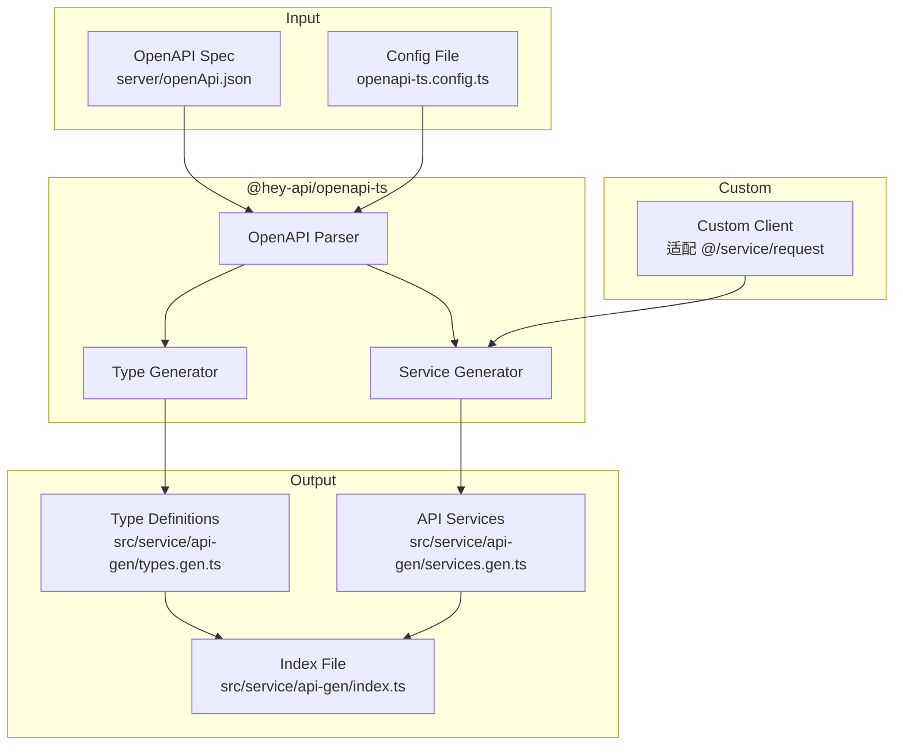

# Design Document: Frontend API Code Generation

## Overview

本设计文档描述了使用成熟的 OpenAPI 代码生成库来实现前端 API 代码自动生成的方案。通过配置 **@hey-api/openapi-ts** 库，读取后端 NestJS 服务生成的 `openApi.json` 文件，自动生成与现有代码风格一致的 TypeScript API 调用函数和类型定义。

生成的代码将通过自定义客户端配置与现有的 `@/service/request` 封装无缝集成，保持与手写 API 代码相同的调用方式和类型安全性。

## Technology Selection

### 选用库: @hey-api/openapi-ts

选择理由：
- 活跃维护，是 openapi-typescript-codegen 的官方继任者
- 支持自定义 HTTP 客户端，可以适配现有的 `request` 封装
- 生成完整的类型定义和 API 函数
- 支持按 tag 分组输出
- 配置灵活，支持自定义模板

## Architecture



## Components and Interfaces

### 1. 配置文件 (openapi-ts.config.ts)

```typescript
import { defineConfig } from '@hey-api/openapi-ts';

export default defineConfig({
  client: '@hey-api/client-fetch',
  input: '../server/openApi.json',
  output: {
    path: 'src/service/api-gen',
    format: 'prettier',
  },
  plugins: [
    '@hey-api/typescript',
    '@hey-api/sdk',
  ],
});
```

### 2. 自定义客户端适配器

为了与现有的 `@/service/request` 封装集成，需要创建一个客户端适配器：

```typescript
// src/service/api-gen/client.ts
import { request } from '@/service/request';

export const client = {
  async request<T>(options: {
    url: string;
    method: string;
    body?: unknown;
    query?: Record<string, unknown>;
    path?: Record<string, unknown>;
    headers?: Record<string, string>;
  }): Promise<T> {
    // 处理路径参数
    let url = options.url;
    if (options.path) {
      Object.entries(options.path).forEach(([key, value]) => {
        url = url.replace(`{${key}}`, String(value));
      });
    }

    const { data } = await request<T>({
      url,
      method: options.method,
      params: options.query,
      data: options.body,
      headers: options.headers,
    });

    return data;
  },
};
```

### 3. 生成的类型定义

@hey-api/openapi-ts 会自动从 OpenAPI schemas 生成 TypeScript 类型：

```typescript
// src/service/api-gen/types.gen.ts (自动生成)
export interface LoginDto {
  username: string;
  password: string;
  code?: string;
  uuid?: string;
}

export interface CreateConfigDto {
  configName: string;
  configKey: string;
  configValue: string;
  configType?: string;
  remark?: string;
}
// ... 更多类型
```

### 4. 生成的 API 服务

```typescript
// src/service/api-gen/services.gen.ts (自动生成)
import { client } from './client';
import type { LoginDto, CreateConfigDto } from './types.gen';

/** 用户登录 */
export const mainControllerLogin = (data: LoginDto) => {
  return client.request<void>({
    url: '/login',
    method: 'POST',
    body: data,
  });
};

/** 参数设置-创建 */
export const configControllerCreate = (data: CreateConfigDto) => {
  return client.request<void>({
    url: '/system/config',
    method: 'POST',
    body: data,
  });
};
// ... 更多 API 函数
```

## Data Models

### Configuration Model

```typescript
// openapi-ts.config.ts
import { defineConfig } from '@hey-api/openapi-ts';

export default defineConfig({
  client: false, // 使用自定义客户端
  input: '../server/openApi.json',
  output: {
    path: 'src/service/api-gen',
    format: 'prettier',
  },
  plugins: [
    '@hey-api/typescript', // 生成类型
    {
      name: '@hey-api/sdk',
      asClass: false, // 生成函数而非类
    },
  ],
});
```

### Generated File Structure

```
admin-naive-ui/src/service/api-gen/
├── index.ts              # 统一导出
├── client.ts             # 自定义客户端适配器（手动创建）
├── types.gen.ts          # 所有类型定义（自动生成）
├── services.gen.ts       # 所有 API 函数（自动生成）
└── sdk.gen.ts            # SDK 入口（自动生成）
```

## Correctness Properties

*由于使用成熟的第三方库 @hey-api/openapi-ts，大部分正确性属性由库本身保证。我们只需要验证自定义客户端适配器的正确性。*

### Property 1: Client Adapter Request Forwarding

*For any* API 调用，自定义客户端适配器应正确将请求参数转发给现有的 `request` 封装，包括 URL、方法、查询参数、请求体和请求头。

**Validates: Requirements 3.1**

### Property 2: Path Parameter Substitution

*For any* 包含路径参数的 URL 模板（如 `/system/config/{id}`），客户端适配器应正确将 `{id}` 替换为实际的参数值。

**Validates: Requirements 3.3**

### Property 3: Generated Code Compilability

*For any* 生成的代码，应能通过 TypeScript 编译检查，无类型错误。

**Validates: Requirements 7.2**

## Error Handling

由 @hey-api/openapi-ts 库处理，主要错误场景：

| Error Type | Condition | Handling |
|------------|-----------|----------|
| FileNotFoundError | OpenAPI 规范文件不存在 | 库输出错误信息并退出 |
| InvalidOpenAPIError | 不符合 OpenAPI 规范 | 库输出验证错误详情 |
| OutputError | 无法写入输出目录 | 库输出错误信息 |

## Testing Strategy

### Integration Tests

由于使用成熟库，测试重点在集成验证：

1. **TypeScript 编译测试**
   - 运行 `pnpm typecheck` 验证生成的代码无类型错误

2. **客户端适配器测试**
   - 验证自定义客户端正确调用 `request` 封装
   - 验证路径参数替换正确

3. **端到端测试**
   - 使用生成的 API 函数调用实际后端接口
   - 验证请求和响应正确
