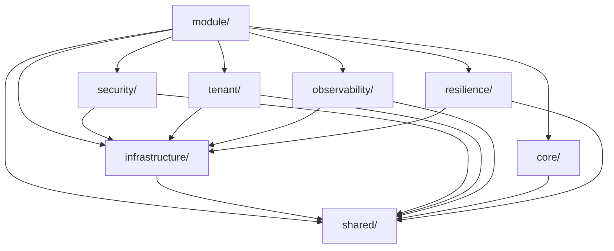

# Design Document: Server Directory Optimization

## Overview

本设计文档描述了 NestJS 后端服务器目录结构的优化方案。目标是消除重复目录、统一功能分层、集中管理测试文件，建立清晰、可维护的项目架构。

### 当前问题分析

1. **重复目录结构**
   - `common/` 包含 27 个子目录
   - `shared/` 包含 8 个子目录
   - 重叠内容：dto, entities, exceptions, utils, validators, response, constants/constant, enums/enum

2. **功能分散**
   - 缓存：`common/cache/` 和 `infrastructure/cache/`
   - 数据加载：`common/dataloader/` 和 `infrastructure/dataloader/`
   - 日志：`common/logger/` 和 `infrastructure/logging/`

3. **测试文件分散**
   - 约 90+ 个 `.spec.ts` 文件分布在 `src/` 各处
   - 与源代码混合，不便于统一管理

4. **空目录和命名不一致**
   - `cls/` 目录为空
   - `interceptor/` 和 `interceptors/` 同时存在

## Architecture

### 目标目录结构

```
server/src/
├── config/                    # 配置管理
│   ├── types/
│   └── *.ts
├── core/                      # 核心层（全局功能）
│   ├── decorators/           # 装饰器
│   ├── filters/              # 异常过滤器
│   ├── guards/               # 守卫
│   ├── interceptors/         # 拦截器
│   └── middleware/           # 中间件
├── infrastructure/            # 基础设施层
│   ├── cache/                # 缓存（合并 common/cache）
│   ├── database/             # 数据库
│   ├── dataloader/           # 数据加载器（合并 common/dataloader）
│   ├── http/                 # HTTP 客户端
│   ├── logging/              # 日志（合并 common/logger）
│   ├── prisma/               # Prisma ORM（从 src/prisma 迁移）
│   ├── queue/                # 队列
│   ├── redis/                # Redis
│   └── repository/           # 仓储基类（从 common/repository 迁移）
├── module/                    # 业务模块
│   ├── auth/
│   ├── backup/
│   ├── common/               # 公共模块（axios, bull, redis）
│   ├── main/
│   ├── monitor/
│   ├── resource/
│   ├── system/
│   └── upload/
├── observability/             # 可观测性层
│   ├── audit/                # 审计（合并 common/audit）
│   ├── health/               # 健康检查（合并 common/health）
│   └── metrics/              # 指标（合并 common/metrics）
├── security/                  # 安全层
│   ├── crypto/               # 加密（合并 common/crypto）
│   ├── login/                # 登录安全（合并 common/security）
│   └── token/                # Token 管理
├── shared/                    # 共享层
│   ├── constants/            # 常量（合并 common/constant）
│   ├── dto/                  # DTO（合并 common/dto）
│   ├── entities/             # 实体（合并 common/entities）
│   ├── enums/                # 枚举（合并 common/enum）
│   ├── exceptions/           # 异常（合并 common/exceptions）
│   ├── response/             # 响应（合并 common/response）
│   ├── utils/                # 工具（合并 common/utils）
│   └── validators/           # 验证器（合并 common/validators）
├── tenant/                    # 租户层
│   ├── context/
│   ├── decorators/
│   ├── extensions/
│   ├── guards/
│   ├── middleware/
│   └── services/             # 合并 common/tenant 的服务
├── resilience/                # 弹性层
│   ├── circuit-breaker/      # 合并 common/resilience
│   └── retry/
├── test-utils/                # 测试工具
│   └── *.ts
├── app.module.ts
└── main.ts

server/test/                   # 测试目录（集中管理）
├── unit/                      # 单元测试
│   ├── config/
│   ├── core/
│   ├── infrastructure/
│   ├── module/
│   ├── observability/
│   ├── security/
│   ├── shared/
│   ├── tenant/
│   └── resilience/
├── integration/               # 集成测试
├── e2e/                       # 端到端测试
├── fixtures/                  # 测试数据
├── helpers/                   # 测试辅助
└── setup.ts
```

## Components and Interfaces

### 迁移映射表

#### 1. common/ → 各目标目录

| 源目录 | 目标目录 | 说明 |
|--------|----------|------|
| `common/audit/` | `observability/audit/` | 审计功能 |
| `common/cache/` | `infrastructure/cache/` | 缓存服务 |
| `common/cls/` | `tenant/context/` | CLS 上下文 |
| `common/constant/` | `shared/constants/` | 常量定义 |
| `common/crypto/` | `security/crypto/` | 加密服务 |
| `common/dataloader/` | `infrastructure/dataloader/` | 数据加载器 |
| `common/decorators/` | `core/decorators/` | 装饰器 |
| `common/dto/` | `shared/dto/` | DTO |
| `common/entities/` | `shared/entities/` | 实体 |
| `common/enum/` | `shared/enums/` | 枚举 |
| `common/exceptions/` | `shared/exceptions/` | 异常 |
| `common/filters/` | `core/filters/` | 过滤器 |
| `common/guards/` | `core/guards/` | 守卫 |
| `common/health/` | `observability/health/` | 健康检查 |
| `common/interceptor/` | `core/interceptors/` | 拦截器（合并） |
| `common/interceptors/` | `core/interceptors/` | 拦截器（合并） |
| `common/logger/` | `infrastructure/logging/` | 日志 |
| `common/metrics/` | `observability/metrics/` | 指标 |
| `common/middleware/` | `core/middleware/` | 中间件 |
| `common/prisma/` | `infrastructure/prisma/` | Prisma 扩展 |
| `common/repository/` | `infrastructure/repository/` | 仓储基类 |
| `common/resilience/` | `resilience/circuit-breaker/` | 熔断器 |
| `common/response/` | `shared/response/` | 响应 |
| `common/security/` | `security/login/` | 登录安全 |
| `common/tenant/` | `tenant/services/` | 租户服务 |
| `common/utils/` | `shared/utils/` | 工具 |
| `common/validators/` | `shared/validators/` | 验证器 |

#### 2. 其他迁移

| 源目录 | 目标目录 | 说明 |
|--------|----------|------|
| `src/prisma/` | `infrastructure/prisma/` | Prisma 服务 |
| `src/cls/` | 删除 | 空目录 |

### 模块依赖关系



## Data Models

### 测试文件迁移映射

测试文件将按照以下规则迁移：

```
src/{path}/{name}.spec.ts → test/unit/{path}/{name}.spec.ts
src/{path}/{name}.pbt.spec.ts → test/unit/{path}/{name}.pbt.spec.ts
src/{path}/{name}.integration.spec.ts → test/integration/{path}/{name}.spec.ts
```

示例：
- `src/config/config.transformer.spec.ts` → `test/unit/config/config.transformer.spec.ts`
- `src/common/tenant/tenant.middleware.pbt.spec.ts` → `test/unit/tenant/tenant.middleware.pbt.spec.ts`
- `src/common/tenant/tenant.middleware.integration.spec.ts` → `test/integration/tenant/tenant.middleware.spec.ts`

## Correctness Properties

*A property is a characteristic or behavior that should hold true across all valid executions of a system-essentially, a formal statement about what the system should do. Properties serve as the bridge between human-readable specifications and machine-verifiable correctness guarantees.*


Based on the prework analysis, most acceptance criteria are structural requirements about file organization that can be verified through examples (checking if files exist in correct locations). The key testable properties are:

### Property 1: Compilation Integrity

*For any* source file in the migrated codebase, TypeScript compilation SHALL succeed without import path errors.

**Validates: Requirements 2.3, 9.1, 9.2**

### Property 2: Test Suite Integrity

*For any* test file in the migrated test directory, Jest SHALL be able to locate and execute the test successfully.

**Validates: Requirements 8.4, 9.3**

## Error Handling

### 迁移错误处理

1. **导入路径错误**
   - 使用 TypeScript 编译器检测
   - 自动化脚本批量更新导入路径

2. **文件冲突**
   - 合并目录时检查文件名冲突
   - 冲突时保留两个版本并手动解决

3. **测试失败**
   - 迁移后运行完整测试套件
   - 失败测试逐个修复

## Testing Strategy

### 验证方法

1. **编译验证**
   - 运行 `pnpm build` 确保 TypeScript 编译通过
   - 检查无导入路径错误

2. **测试验证**
   - 运行 `pnpm test` 确保所有单元测试通过
   - 运行 `pnpm test:e2e` 确保端到端测试通过

3. **结构验证**
   - 检查 `common/` 目录已删除
   - 检查 `cls/` 空目录已删除
   - 检查所有 `.spec.ts` 文件已迁移到 `test/` 目录

### 测试配置更新

Jest 配置需要更新以支持新的测试文件位置：

```javascript
// jest.config.js
module.exports = {
  rootDir: '.',
  testMatch: [
    '<rootDir>/test/**/*.spec.ts',
    '<rootDir>/test/**/*.pbt.spec.ts'
  ],
  moduleNameMapper: {
    '^@/(.*)$': '<rootDir>/src/$1',
    '^@test/(.*)$': '<rootDir>/test/$1'
  }
};
```

## Migration Strategy

### 阶段 1: 准备工作
1. 创建目标目录结构
2. 备份当前代码

### 阶段 2: 文件迁移
1. 迁移 `common/` 内容到各目标目录
2. 迁移 `src/prisma/` 到 `infrastructure/prisma/`
3. 迁移测试文件到 `test/` 目录

### 阶段 3: 导入路径更新
1. 批量更新所有导入路径
2. 更新模块注册

### 阶段 4: 清理
1. 删除空目录
2. 删除 `common/` 目录

### 阶段 5: 验证
1. TypeScript 编译
2. 运行测试套件
3. 手动验证关键功能
