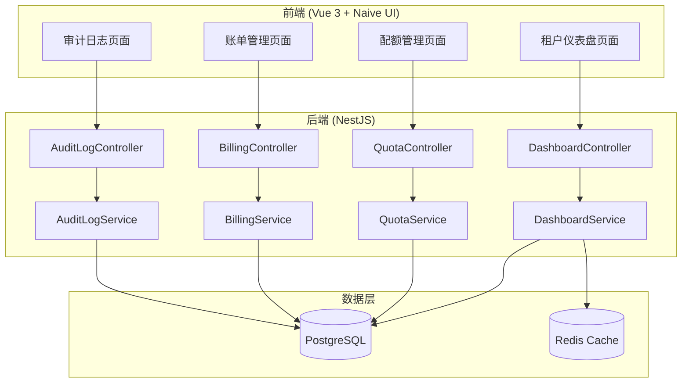

# Design Document: 租户管理增强功能

## Overview

本设计文档描述了多租户管理系统增强功能的技术实现方案，包括租户统计仪表盘、租户配额管理、租户账单/计费和租户审计日志四个核心模块。

系统采用前后端分离架构：
- 前端：Vue 3 + Naive UI + TypeScript
- 后端：NestJS + Prisma + PostgreSQL
- 缓存：Redis

## 与 ruoyi-vue-pro 功能对比

### 已有功能对比

| 功能 | ruoyi-vue-pro | 本项目 | 状态 |
|------|---------------|--------|------|
| 租户管理（CRUD） | ✅ | ✅ | 已实现 |
| 租户套餐管理 | ✅ | ✅ | 已实现 |
| 租户数据隔离（COLUMN模式） | ✅ | ✅ | 已实现 |
| 租户上下文（TenantContext） | ✅ | ✅ | 已实现 |
| 租户忽略注解（@IgnoreTenant） | ✅ | ✅ | 已实现 |
| 同步租户字典 | ✅ | ✅ | 已实现 |
| 同步租户配置 | ✅ | ✅ | 已实现 |
| 同步租户套餐 | ✅ | ✅ | 已实现 |
| 租户独立域名 | ✅ | ✅ | 已实现 |
| 租户切换功能 | ✅ | ⚠️ | 后端有API，前端未实现UI |

### 本次需要新增的功能

| 功能 | ruoyi-vue-pro | 本项目 | 说明 |
|------|---------------|--------|------|
| 租户统计仪表盘 | ❌ | 🆕 | 新增功能 |
| 租户配额管理 | ❌ | 🆕 | 新增功能 |
| 租户账单/计费 | ❌ | 🆕 | 新增功能 |
| 租户审计日志 | ⚠️ 通用操作日志 | 🆕 | 增强为租户级审计 |
| 租户切换UI | ✅ | 🆕 | 补充前端UI |

### ruoyi-vue-pro 有但本项目缺失的功能

| 功能 | 说明 | 优先级 |
|------|------|--------|
| 租户Job（@TenantJob） | 定时任务遍历所有租户执行 | 中 |
| 租户MQ上下文传递 | MQ消息携带租户信息 | 低 |
| 租户Async上下文传递 | 异步任务携带租户信息 | 低 |
| 租户Redis Key隔离 | Redis Key自动添加租户前缀 | 中 |
| 泛域名解析支持 | 根据域名自动识别租户 | 低 |

## Architecture



## Components and Interfaces

### 1. 租户统计仪表盘模块

#### 后端接口

```typescript
// GET /system/tenant/dashboard/stats
interface TenantDashboardStats {
  tenantStats: {
    total: number;           // 租户总数
    active: number;          // 活跃租户数
    newThisMonth: number;    // 本月新增
    expiringSoon: number;    // 即将到期（30天内）
  };
  userStats: {
    total: number;           // 用户总数
    online: number;          // 在线用户数
    todayLogin: number;      // 今日登录数
  };
  resourceStats: {
    storageUsed: number;     // 存储使用量（GB）
    apiCallsThisMonth: number; // 本月API调用次数
  };
}

// GET /system/tenant/dashboard/trend
interface TenantTrendParams {
  startDate: string;
  endDate: string;
  type: 'day' | 'week' | 'month';
}

interface TenantTrendData {
  date: string;
  tenantCount: number;
  userCount: number;
}

// GET /system/tenant/dashboard/package-distribution
interface PackageDistribution {
  packageId: number;
  packageName: string;
  tenantCount: number;
  percentage: number;
}

// GET /system/tenant/dashboard/expiring-tenants
interface ExpiringTenant {
  tenantId: string;
  companyName: string;
  expireTime: string;
  daysRemaining: number;
  packageName: string;
}

// GET /system/tenant/dashboard/quota-top
interface QuotaTopTenant {
  tenantId: string;
  companyName: string;
  quotaType: string;
  used: number;
  limit: number;
  usageRate: number;
}
```

#### 前端组件

```
src/views/system/tenant-dashboard/
├── index.vue                    # 仪表盘主页面
└── modules/
    ├── stat-cards.vue           # 统计卡片组件
    ├── trend-chart.vue          # 趋势图表组件
    ├── package-pie-chart.vue    # 套餐分布饼图
    ├── expiring-list.vue        # 即将到期列表
    └── quota-top-list.vue       # 配额TOP10列表
```

### 2. 租户配额管理模块

#### 后端接口

```typescript
// GET /system/tenant/quota/list
interface TenantQuotaSearchParams {
  tenantId?: string;
  companyName?: string;
  pageNum: number;
  pageSize: number;
}

interface TenantQuota {
  id: number;
  tenantId: string;
  companyName: string;
  userQuota: number;        // 用户数量配额，-1表示不限
  userUsed: number;         // 已使用用户数
  storageQuota: number;     // 存储配额（GB），-1表示不限
  storageUsed: number;      // 已使用存储（GB）
  apiQuota: number;         // API调用配额（月），-1表示不限
  apiUsed: number;          // 本月已调用次数
  status: 'normal' | 'warning' | 'danger';
  createTime: string;
  updateTime: string;
}

// PUT /system/tenant/quota
interface UpdateQuotaParams {
  tenantId: string;
  userQuota?: number;
  storageQuota?: number;
  apiQuota?: number;
}

// GET /system/tenant/quota/:tenantId
interface TenantQuotaDetail extends TenantQuota {
  quotaHistory: QuotaChangeRecord[];
}

interface QuotaChangeRecord {
  id: number;
  quotaType: string;
  oldValue: number;
  newValue: number;
  changeBy: string;
  changeTime: string;
}
```

#### 前端组件

```
src/views/system/tenant-quota/
├── index.vue                    # 配额管理主页面
└── modules/
    ├── quota-search.vue         # 搜索组件
    ├── quota-table.vue          # 配额列表表格
    ├── quota-edit-drawer.vue    # 配额编辑抽屉
    └── quota-progress.vue       # 配额进度条组件
```

### 3. 租户账单/计费模块

#### 后端接口

```typescript
// GET /system/tenant/billing/list
interface BillingSearchParams {
  tenantId?: string;
  status?: BillingStatus;
  startDate?: string;
  endDate?: string;
  pageNum: number;
  pageSize: number;
}

type BillingStatus = 'pending' | 'paid' | 'cancelled' | 'overdue';
type BillingCycle = 'monthly' | 'quarterly' | 'yearly';

interface TenantBilling {
  id: number;
  billNo: string;           // 账单编号
  tenantId: string;
  companyName: string;
  amount: number;           // 账单金额
  cycle: BillingCycle;      // 计费周期
  status: BillingStatus;
  dueDate: string;          // 到期日
  paidTime?: string;        // 支付时间
  overdueDays?: number;     // 逾期天数
  overdueAmount?: number;   // 逾期金额
  remark?: string;
  createTime: string;
}

// POST /system/tenant/billing
interface CreateBillingParams {
  tenantId: string;
  amount: number;
  cycle: BillingCycle;
  dueDate: string;
  items: BillingItem[];
  remark?: string;
}

interface BillingItem {
  name: string;             // 项目名称
  type: 'package' | 'overage' | 'other';
  amount: number;
  description?: string;
}

// GET /system/tenant/billing/:id
interface BillingDetail extends TenantBilling {
  items: BillingItem[];
}

// PUT /system/tenant/billing/status
interface UpdateBillingStatusParams {
  id: number;
  status: BillingStatus;
}

// GET /system/tenant/billing/summary
interface BillingSummary {
  monthlyIncome: number;    // 本月收入
  pendingAmount: number;    // 待收款
  overdueAmount: number;    // 已逾期金额
  totalBills: number;       // 账单总数
}

// POST /system/tenant/billing/export
// 导出Excel
```

#### 前端组件

```
src/views/system/tenant-billing/
├── index.vue                    # 账单管理主页面
└── modules/
    ├── billing-search.vue       # 搜索组件
    ├── billing-summary.vue      # 统计汇总卡片
    ├── billing-table.vue        # 账单列表表格
    ├── billing-create-drawer.vue # 创建账单抽屉
    └── billing-detail-modal.vue  # 账单详情弹窗
```

### 4. 租户审计日志模块

#### 后端接口

```typescript
// GET /system/tenant/audit/list
interface AuditLogSearchParams {
  tenantId?: string;
  operatorName?: string;
  actionType?: AuditActionType;
  startTime?: string;
  endTime?: string;
  pageNum: number;
  pageSize: number;
}

type AuditActionType = 
  | 'login' | 'logout'           // 登录登出
  | 'create' | 'update' | 'delete' // 数据操作
  | 'permission_change'          // 权限变更
  | 'config_change'              // 配置修改
  | 'export'                     // 数据导出
  | 'other';

interface TenantAuditLog {
  id: number;
  tenantId: string;
  companyName: string;
  operatorId: number;
  operatorName: string;
  actionType: AuditActionType;
  actionDesc: string;           // 操作描述
  module: string;               // 操作模块
  ipAddress: string;
  userAgent?: string;
  requestUrl?: string;
  requestMethod?: string;
  operateTime: string;
}

// GET /system/tenant/audit/:id
interface AuditLogDetail extends TenantAuditLog {
  beforeData?: string;          // 操作前数据（JSON）
  afterData?: string;           // 操作后数据（JSON）
  requestParams?: string;       // 请求参数
  responseData?: string;        // 响应数据
}

// POST /system/tenant/audit/export
// 导出Excel
```

#### 前端组件

```
src/views/system/tenant-audit/
├── index.vue                    # 审计日志主页面
└── modules/
    ├── audit-search.vue         # 搜索组件
    ├── audit-table.vue          # 日志列表表格
    └── audit-detail-modal.vue   # 日志详情弹窗
```

### 5. 租户切换功能模块

#### 后端接口

```typescript
// GET /system/tenant/dynamic/:tenantId
// 动态切换到指定租户
interface ChangeTenantResponse {
  success: boolean;
  tenantId: string;
  companyName: string;
}

// GET /system/tenant/dynamic/clear
// 清除租户切换，恢复原租户
interface ClearTenantResponse {
  success: boolean;
  originalTenantId: string;
}

// GET /system/tenant/select-list
// 获取可切换的租户列表（仅超级管理员可用）
interface TenantSelectItem {
  tenantId: string;
  companyName: string;
  status: string;
}
```

#### 前端组件

```
src/layouts/modules/
└── tenant-switch/
    ├── index.vue                # 租户切换下拉组件
    └── tenant-select-modal.vue  # 租户选择弹窗
```

#### 功能说明

1. 在顶部导航栏显示当前租户名称
2. 超级管理员可点击切换到其他租户
3. 切换后显示"已切换到 XXX 租户"提示
4. 提供"恢复原租户"按钮

## Data Models

### 数据库表设计

```prisma
// 租户配额表
model SysTenantQuota {
  id           Int      @id @default(autoincrement())
  tenantId     String   @unique @map("tenant_id")
  userQuota    Int      @default(-1) @map("user_quota")
  userUsed     Int      @default(0) @map("user_used")
  storageQuota BigInt   @default(-1) @map("storage_quota")
  storageUsed  BigInt   @default(0) @map("storage_used")
  apiQuota     Int      @default(-1) @map("api_quota")
  apiUsed      Int      @default(0) @map("api_used")
  createTime   DateTime @default(now()) @map("create_time")
  updateTime   DateTime @updatedAt @map("update_time")
  
  @@map("sys_tenant_quota")
}

// 配额变更记录表
model SysTenantQuotaLog {
  id         Int      @id @default(autoincrement())
  tenantId   String   @map("tenant_id")
  quotaType  String   @map("quota_type")
  oldValue   BigInt   @map("old_value")
  newValue   BigInt   @map("new_value")
  changeBy   String   @map("change_by")
  changeTime DateTime @default(now()) @map("change_time")
  
  @@map("sys_tenant_quota_log")
}

// 租户账单表
model SysTenantBilling {
  id          Int      @id @default(autoincrement())
  billNo      String   @unique @map("bill_no")
  tenantId    String   @map("tenant_id")
  amount      Decimal  @db.Decimal(10, 2)
  cycle       String   // monthly, quarterly, yearly
  status      String   @default("pending") // pending, paid, cancelled, overdue
  dueDate     DateTime @map("due_date")
  paidTime    DateTime? @map("paid_time")
  remark      String?
  createBy    String   @map("create_by")
  createTime  DateTime @default(now()) @map("create_time")
  updateTime  DateTime @updatedAt @map("update_time")
  
  items       SysTenantBillingItem[]
  
  @@map("sys_tenant_billing")
}

// 账单明细表
model SysTenantBillingItem {
  id          Int      @id @default(autoincrement())
  billingId   Int      @map("billing_id")
  name        String
  type        String   // package, overage, other
  amount      Decimal  @db.Decimal(10, 2)
  description String?
  
  billing     SysTenantBilling @relation(fields: [billingId], references: [id])
  
  @@map("sys_tenant_billing_item")
}

// 租户审计日志表
model SysTenantAuditLog {
  id            BigInt   @id @default(autoincrement())
  tenantId      String   @map("tenant_id")
  operatorId    Int      @map("operator_id")
  operatorName  String   @map("operator_name")
  actionType    String   @map("action_type")
  actionDesc    String   @map("action_desc")
  module        String
  ipAddress     String   @map("ip_address")
  userAgent     String?  @map("user_agent")
  requestUrl    String?  @map("request_url")
  requestMethod String?  @map("request_method")
  requestParams String?  @map("request_params") @db.Text
  beforeData    String?  @map("before_data") @db.Text
  afterData     String?  @map("after_data") @db.Text
  responseData  String?  @map("response_data") @db.Text
  operateTime   DateTime @default(now()) @map("operate_time")
  
  @@index([tenantId])
  @@index([operatorId])
  @@index([actionType])
  @@index([operateTime])
  @@map("sys_tenant_audit_log")
}
```

## Correctness Properties

*A property is a characteristic or behavior that should hold true across all valid executions of a system-essentially, a formal statement about what the system should do. Properties serve as the bridge between human-readable specifications and machine-verifiable correctness guarantees.*

### Property 1: 列表查询数据完整性

*For any* 列表查询请求（短信渠道、邮箱账号、站内信模板、租户配额、审计日志），返回的数据应包含所有必需字段，且数量与数据库中符合条件的记录数一致。

**Validates: Requirements 1.1, 2.1, 3.1, 5.1, 6.1**

### Property 2: 筛选功能正确性

*For any* 带筛选条件的查询请求，返回的所有记录都应满足所有指定的筛选条件。

**Validates: Requirements 1.5, 2.5, 6.2**

### Property 3: 模板变量解析正确性

*For any* 包含变量占位符的模板和变量值映射，解析后的内容应将所有占位符替换为对应的值，且不包含未替换的占位符。

**Validates: Requirements 1.3, 2.3, 3.2**

### Property 4: 消息发送日志完整性

*For any* 短信或邮件发送操作，无论成功或失败，都应在日志表中创建一条记录，包含发送时间、状态、内容等必需字段。

**Validates: Requirements 1.4, 2.4**

### Property 5: 站内信未读计数正确性

*For any* 用户的站内信列表，未读消息数量应等于该用户所有状态为未读的消息记录数。

**Validates: Requirements 3.4**

### Property 6: 站内信已读标记正确性

*For any* 站内信查看操作，操作后该消息的状态应变为已读，且未读计数应减少1。

**Validates: Requirements 3.5**

### Property 7: 软删除数据保留

*For any* 软删除操作（站内信删除），记录应仍存在于数据库中，但delFlag字段应标记为已删除。

**Validates: Requirements 3.6**

### Property 8: 租户统计数据一致性

*For any* 仪表盘统计查询，租户总数应等于数据库中状态正常的租户记录数，活跃租户数应等于最近30天有登录记录的租户数。

**Validates: Requirements 4.1, 4.2**

### Property 9: 时间范围筛选正确性

*For any* 时间范围查询（趋势图、日志筛选），返回的所有数据的时间字段都应在指定的开始时间和结束时间之间。

**Validates: Requirements 4.3**

### Property 10: 即将到期租户筛选正确性

*For any* 即将到期租户查询，返回的所有租户的到期时间应在当前时间到当前时间+30天之间。

**Validates: Requirements 4.5**

### Property 11: 配额数据完整性

*For any* 租户配额查询，返回的数据应包含用户数量、存储空间、API调用次数三种配额的限制值和使用量。

**Validates: Requirements 5.2**

### Property 12: 配额更新持久化

*For any* 配额更新操作，更新后再次查询应返回更新后的值。

**Validates: Requirements 5.3**

### Property 13: 无限配额处理

*For any* 配额值为-1的租户，配额检查应始终返回允许，不会阻止任何操作。

**Validates: Requirements 5.4**

### Property 14: 配额警告阈值

*For any* 租户配额，当使用率在80%-99%之间时状态应为warning，达到100%时状态应为danger。

**Validates: Requirements 5.5, 5.6**

### Property 15: 审计日志自动记录

*For any* 登录、数据CRUD、权限变更、配置修改操作，操作完成后审计日志表中应有对应的记录。

**Validates: Requirements 6.4**

### Property 16: 租户切换上下文正确性

*For any* 租户切换操作，切换后的所有数据查询应只返回目标租户的数据。

**Validates: Requirements 7.2**

### Property 17: 租户恢复正确性

*For any* 租户恢复操作，恢复后的租户上下文应与切换前一致。

**Validates: Requirements 7.4**

### Property 18: 幂等性核心逻辑

*For any* 标记了@Idempotent的方法，在过期时间内使用相同参数调用多次，应只执行一次实际逻辑，后续调用返回相同结果。

**Validates: Requirements 9.2, 9.3**

### Property 19: 幂等性异常处理

*For any* 标记了@Idempotent的方法执行异常时，应删除幂等Key，允许下次请求重新执行。

**Validates: Requirements 9.5**

### Property 20: 分布式锁互斥性

*For any* 标记了@Lock的方法，同一时间只能有一个执行实例持有锁，其他实例应等待或抛出异常。

**Validates: Requirements 10.2, 10.3**

### Property 21: 分布式锁自动释放

*For any* 标记了@Lock的方法执行完成后（无论成功或异常），锁应被自动释放。

**Validates: Requirements 10.6**

### Property 22: 数据权限过滤正确性

*For any* 启用了数据权限的查询，返回的所有数据都应符合当前用户的数据权限范围。

**Validates: Requirements 11.2, 11.3**

### Property 23: 数据权限禁用正确性

*For any* 设置了enable=false的@DataPermission，查询应返回所有数据，不进行权限过滤。

**Validates: Requirements 11.5**

### Property 24: 租户任务遍历正确性

*For any* 标记了@TenantJob的定时任务，应遍历所有状态正常的租户执行任务逻辑。

**Validates: Requirements 12.2**

### Property 25: 租户任务上下文隔离

*For any* @TenantJob任务执行过程中，每个租户的执行应在正确的租户上下文中，且租户之间的执行相互隔离。

**Validates: Requirements 12.3**

### Property 26: 租户任务错误隔离

*For any* @TenantJob任务执行中某个租户失败，不应影响其他租户的执行，且失败应被记录。

**Validates: Requirements 12.4**

## Error Handling

### 后端错误处理

| 错误场景 | HTTP状态码 | 错误码 | 错误信息 |
|---------|-----------|--------|---------|
| 租户不存在 | 404 | TENANT_NOT_FOUND | 租户不存在 |
| 配额超限 | 400 | QUOTA_EXCEEDED | 配额已用尽，请联系管理员 |
| 账单不存在 | 404 | BILLING_NOT_FOUND | 账单不存在 |
| 无效的账单状态 | 400 | INVALID_BILLING_STATUS | 无效的账单状态 |
| 无权限访问 | 403 | ACCESS_DENIED | 无权访问该资源 |
| 参数验证失败 | 400 | VALIDATION_ERROR | 参数验证失败 |
| 数据库操作失败 | 500 | DATABASE_ERROR | 数据库操作失败 |

### 前端错误处理

- 网络错误：显示"网络连接失败，请检查网络"
- 超时错误：显示"请求超时，请稍后重试"
- 权限错误：跳转到403页面或显示无权限提示
- 业务错误：显示后端返回的错误信息

## 短信管理模块设计

### 后端接口

```typescript
// 短信渠道管理
// GET /system/sms/channel/list
interface SmsChannelSearchParams {
  name?: string;
  code?: string;
  status?: number;
  pageNum: number;
  pageSize: number;
}

interface SmsChannel {
  id: number;
  code: string;              // 渠道编码：aliyun, tencent, huawei
  name: string;              // 渠道名称
  signature: string;         // 短信签名
  apiKey: string;            // API Key
  apiSecret: string;         // API Secret (加密存储)
  callbackUrl?: string;      // 回调地址
  status: number;            // 0-禁用 1-启用
  remark?: string;
  createTime: string;
}

// POST /system/sms/channel
interface CreateSmsChannelParams {
  code: string;
  name: string;
  signature: string;
  apiKey: string;
  apiSecret: string;
  callbackUrl?: string;
  status: number;
  remark?: string;
}

// 短信模板管理
// GET /system/sms/template/list
interface SmsTemplate {
  id: number;
  channelId: number;
  channelCode: string;
  code: string;              // 模板编码
  name: string;              // 模板名称
  content: string;           // 模板内容
  params: string[];          // 参数列表
  apiTemplateId: string;     // 第三方模板ID
  type: number;              // 1-验证码 2-通知 3-营销
  status: number;
  remark?: string;
  createTime: string;
}

// 短信发送日志
// GET /system/sms/log/list
interface SmsLog {
  id: number;
  channelId: number;
  channelCode: string;
  templateId: number;
  templateCode: string;
  mobile: string;
  content: string;
  params: Record<string, string>;
  sendStatus: number;        // 0-发送中 1-成功 2-失败
  sendTime: string;
  receiveStatus?: number;    // 0-未接收 1-已接收
  receiveTime?: string;
  apiSendCode?: string;      // 第三方发送编码
  apiReceiveCode?: string;   // 第三方接收编码
  errorMsg?: string;
}

// POST /system/sms/send
interface SendSmsParams {
  mobile: string;
  templateCode: string;
  params: Record<string, string>;
}
```

### 前端组件

```
src/views/system/sms/
├── channel/
│   ├── index.vue                # 渠道管理页面
│   └── modules/
│       ├── channel-search.vue
│       ├── channel-table.vue
│       └── channel-operate-drawer.vue
├── template/
│   ├── index.vue                # 模板管理页面
│   └── modules/
│       ├── template-search.vue
│       ├── template-table.vue
│       └── template-operate-drawer.vue
└── log/
    ├── index.vue                # 发送日志页面
    └── modules/
        ├── log-search.vue
        └── log-table.vue
```

## 邮件管理模块设计

### 后端接口

```typescript
// 邮箱账号管理
// GET /system/mail/account/list
interface MailAccount {
  id: number;
  mail: string;              // 邮箱地址
  username: string;          // 用户名
  password: string;          // 密码 (加密存储)
  host: string;              // SMTP主机
  port: number;              // SMTP端口
  sslEnable: boolean;        // 是否SSL
  status: number;
  remark?: string;
  createTime: string;
}

// 邮件模板管理
// GET /system/mail/template/list
interface MailTemplate {
  id: number;
  name: string;              // 模板名称
  code: string;              // 模板编码
  accountId: number;         // 发送账号
  nickname: string;          // 发送人昵称
  title: string;             // 邮件标题
  content: string;           // 邮件内容 (HTML)
  params: string[];          // 参数列表
  status: number;
  remark?: string;
  createTime: string;
}

// 邮件发送日志
// GET /system/mail/log/list
interface MailLog {
  id: number;
  userId?: number;
  userType?: number;
  toMail: string;
  accountId: number;
  fromMail: string;
  templateId: number;
  templateCode: string;
  templateNickname: string;
  templateTitle: string;
  templateContent: string;
  templateParams: Record<string, string>;
  sendStatus: number;        // 0-发送中 1-成功 2-失败
  sendTime: string;
  errorMsg?: string;
}

// POST /system/mail/send
interface SendMailParams {
  toMail: string;
  templateCode: string;
  params: Record<string, string>;
}
```

### 前端组件

```
src/views/system/mail/
├── account/
│   ├── index.vue                # 账号管理页面
│   └── modules/
│       ├── account-search.vue
│       ├── account-table.vue
│       └── account-operate-drawer.vue
├── template/
│   ├── index.vue                # 模板管理页面
│   └── modules/
│       ├── template-search.vue
│       ├── template-table.vue
│       └── template-operate-drawer.vue
└── log/
    ├── index.vue                # 发送日志页面
    └── modules/
        ├── log-search.vue
        └── log-table.vue
```

## 站内信模块设计

### 后端接口

```typescript
// 站内信模板管理
// GET /system/notify/template/list
interface NotifyTemplate {
  id: number;
  name: string;              // 模板名称
  code: string;              // 模板编码
  nickname: string;          // 发送人名称
  content: string;           // 模板内容
  params: string[];          // 参数列表
  type: number;              // 1-系统通知 2-业务通知
  status: number;
  remark?: string;
  createTime: string;
}

// 站内信消息管理
// GET /system/notify/message/list
interface NotifyMessage {
  id: number;
  userId: number;
  userType: number;
  templateId: number;
  templateCode: string;
  templateNickname: string;
  templateContent: string;
  templateParams: Record<string, string>;
  readStatus: boolean;       // 是否已读
  readTime?: string;
  createTime: string;
}

// GET /system/notify/message/unread-count
interface UnreadCountResponse {
  count: number;
}

// PUT /system/notify/message/read/:id
// 标记单条已读

// PUT /system/notify/message/read-all
// 标记全部已读

// POST /system/notify/send
interface SendNotifyParams {
  userIds: number[];         // 接收用户ID列表
  templateCode: string;
  params: Record<string, string>;
}

// POST /system/notify/send-all
interface SendNotifyAllParams {
  templateCode: string;
  params: Record<string, string>;
}
```

### 前端组件

```
src/views/system/notify/
├── template/
│   ├── index.vue                # 模板管理页面
│   └── modules/
│       ├── template-search.vue
│       ├── template-table.vue
│       └── template-operate-drawer.vue
└── message/
    ├── index.vue                # 消息管理页面
    └── modules/
        ├── message-search.vue
        ├── message-table.vue
        └── message-send-drawer.vue

src/layouts/modules/
└── notify-bell/
    ├── index.vue                # 通知铃铛组件
    └── notify-dropdown.vue      # 通知下拉列表
```

## 装饰器实现设计

### @Idempotent 幂等性装饰器

```typescript
// server/src/core/decorators/idempotent.decorator.ts

export interface IdempotentOptions {
  timeout?: number;          // 过期时间（秒），默认5
  keyResolver?: string;      // Key生成策略
  message?: string;          // 重复请求提示信息
  deleteOnError?: boolean;   // 异常时是否删除Key，默认true
}

export const IDEMPOTENT_KEY = 'IDEMPOTENT';

export function Idempotent(options: IdempotentOptions = {}): MethodDecorator {
  return (target, propertyKey, descriptor) => {
    Reflect.defineMetadata(IDEMPOTENT_KEY, options, descriptor.value);
    return descriptor;
  };
}

// 使用示例
@Post('create')
@Idempotent({ timeout: 10, message: '请勿重复提交' })
async createOrder(@Body() dto: CreateOrderDto) {
  // ...
}
```

### @Lock 分布式锁装饰器

```typescript
// server/src/core/decorators/lock.decorator.ts

export interface LockOptions {
  key: string;               // 锁Key（支持SpEL表达式）
  waitTime?: number;         // 等待时间（秒），默认0
  leaseTime?: number;        // 持有时间（秒），默认30
  message?: string;          // 获取锁失败提示
}

export const LOCK_KEY = 'LOCK';

export function Lock(options: LockOptions): MethodDecorator {
  return (target, propertyKey, descriptor) => {
    Reflect.defineMetadata(LOCK_KEY, options, descriptor.value);
    return descriptor;
  };
}

// 使用示例
@Put(':id')
@Lock({ key: 'order:#{#id}', leaseTime: 60 })
async updateOrder(@Param('id') id: number, @Body() dto: UpdateOrderDto) {
  // ...
}
```

### @DataPermission 数据权限装饰器

```typescript
// server/src/core/decorators/data-permission.decorator.ts

export interface DataPermissionOptions {
  enable?: boolean;          // 是否启用，默认true
  deptAlias?: string;        // 部门表别名
  userAlias?: string;        // 用户表别名
  deptIdColumn?: string;     // 部门ID字段名
  userIdColumn?: string;     // 用户ID字段名
}

export const DATA_PERMISSION_KEY = 'DATA_PERMISSION';

export function DataPermission(options: DataPermissionOptions = {}): MethodDecorator {
  return (target, propertyKey, descriptor) => {
    Reflect.defineMetadata(DATA_PERMISSION_KEY, options, descriptor.value);
    return descriptor;
  };
}

// 数据权限范围枚举
export enum DataScope {
  ALL = 1,                   // 全部数据
  DEPT_CUSTOM = 2,           // 指定部门数据
  DEPT_ONLY = 3,             // 本部门数据
  DEPT_AND_CHILD = 4,        // 本部门及以下数据
  SELF = 5,                  // 仅本人数据
}

// 使用示例
@Get('list')
@DataPermission({ deptAlias: 'u', deptIdColumn: 'dept_id' })
async getUserList(@Query() query: UserQueryDto) {
  // ...
}
```

### @TenantJob 租户定时任务装饰器

```typescript
// server/src/core/decorators/tenant-job.decorator.ts

export interface TenantJobOptions {
  parallel?: boolean;        // 是否并行执行，默认false
  continueOnError?: boolean; // 错误时是否继续，默认true
}

export const TENANT_JOB_KEY = 'TENANT_JOB';

export function TenantJob(options: TenantJobOptions = {}): MethodDecorator {
  return (target, propertyKey, descriptor) => {
    Reflect.defineMetadata(TENANT_JOB_KEY, options, descriptor.value);
    return descriptor;
  };
}

// 使用示例
@Cron('0 0 2 * * *')
@TenantJob({ parallel: true })
async dailyStatistics() {
  // 此方法会为每个租户执行一次
}
```

## 数据库表设计补充

### 短信相关表

```prisma
// 短信渠道表
model SysSmsChannel {
  id          Int      @id @default(autoincrement())
  code        String   @unique                    // aliyun, tencent, huawei
  name        String
  signature   String                              // 短信签名
  apiKey      String   @map("api_key")
  apiSecret   String   @map("api_secret")
  callbackUrl String?  @map("callback_url")
  status      Int      @default(1)
  remark      String?
  createBy    String?  @map("create_by")
  createTime  DateTime @default(now()) @map("create_time")
  updateBy    String?  @map("update_by")
  updateTime  DateTime @updatedAt @map("update_time")
  
  templates   SysSmsTemplate[]
  
  @@map("sys_sms_channel")
}

// 短信模板表
model SysSmsTemplate {
  id            Int      @id @default(autoincrement())
  channelId     Int      @map("channel_id")
  code          String   @unique
  name          String
  content       String   @db.Text
  params        String?  @db.Text                 // JSON数组
  apiTemplateId String   @map("api_template_id")
  type          Int                               // 1-验证码 2-通知 3-营销
  status        Int      @default(1)
  remark        String?
  createBy      String?  @map("create_by")
  createTime    DateTime @default(now()) @map("create_time")
  updateBy      String?  @map("update_by")
  updateTime    DateTime @updatedAt @map("update_time")
  
  channel       SysSmsChannel @relation(fields: [channelId], references: [id])
  
  @@map("sys_sms_template")
}

// 短信发送日志表
model SysSmsLog {
  id             BigInt   @id @default(autoincrement())
  channelId      Int      @map("channel_id")
  channelCode    String   @map("channel_code")
  templateId     Int      @map("template_id")
  templateCode   String   @map("template_code")
  mobile         String
  content        String   @db.Text
  params         String?  @db.Text                // JSON对象
  sendStatus     Int      @default(0) @map("send_status")
  sendTime       DateTime @default(now()) @map("send_time")
  receiveStatus  Int?     @map("receive_status")
  receiveTime    DateTime? @map("receive_time")
  apiSendCode    String?  @map("api_send_code")
  apiReceiveCode String?  @map("api_receive_code")
  errorMsg       String?  @map("error_msg") @db.Text
  
  @@index([mobile])
  @@index([sendTime])
  @@index([sendStatus])
  @@map("sys_sms_log")
}
```

### 邮件相关表

```prisma
// 邮箱账号表
model SysMailAccount {
  id         Int      @id @default(autoincrement())
  mail       String   @unique
  username   String
  password   String                               // 加密存储
  host       String
  port       Int
  sslEnable  Boolean  @default(false) @map("ssl_enable")
  status     Int      @default(1)
  remark     String?
  createBy   String?  @map("create_by")
  createTime DateTime @default(now()) @map("create_time")
  updateBy   String?  @map("update_by")
  updateTime DateTime @updatedAt @map("update_time")
  
  templates  SysMailTemplate[]
  
  @@map("sys_mail_account")
}

// 邮件模板表
model SysMailTemplate {
  id         Int      @id @default(autoincrement())
  name       String
  code       String   @unique
  accountId  Int      @map("account_id")
  nickname   String
  title      String
  content    String   @db.Text                    // HTML内容
  params     String?  @db.Text                    // JSON数组
  status     Int      @default(1)
  remark     String?
  createBy   String?  @map("create_by")
  createTime DateTime @default(now()) @map("create_time")
  updateBy   String?  @map("update_by")
  updateTime DateTime @updatedAt @map("update_time")
  
  account    SysMailAccount @relation(fields: [accountId], references: [id])
  
  @@map("sys_mail_template")
}

// 邮件发送日志表
model SysMailLog {
  id               BigInt   @id @default(autoincrement())
  userId           Int?     @map("user_id")
  userType         Int?     @map("user_type")
  toMail           String   @map("to_mail")
  accountId        Int      @map("account_id")
  fromMail         String   @map("from_mail")
  templateId       Int      @map("template_id")
  templateCode     String   @map("template_code")
  templateNickname String   @map("template_nickname")
  templateTitle    String   @map("template_title")
  templateContent  String   @map("template_content") @db.Text
  templateParams   String?  @map("template_params") @db.Text
  sendStatus       Int      @default(0) @map("send_status")
  sendTime         DateTime @default(now()) @map("send_time")
  errorMsg         String?  @map("error_msg") @db.Text
  
  @@index([toMail])
  @@index([sendTime])
  @@index([sendStatus])
  @@map("sys_mail_log")
}
```

### 站内信相关表

```prisma
// 站内信模板表
model SysNotifyTemplate {
  id         Int      @id @default(autoincrement())
  name       String
  code       String   @unique
  nickname   String
  content    String   @db.Text
  params     String?  @db.Text                    // JSON数组
  type       Int                                  // 1-系统通知 2-业务通知
  status     Int      @default(1)
  remark     String?
  createBy   String?  @map("create_by")
  createTime DateTime @default(now()) @map("create_time")
  updateBy   String?  @map("update_by")
  updateTime DateTime @updatedAt @map("update_time")
  
  @@map("sys_notify_template")
}

// 站内信消息表
model SysNotifyMessage {
  id               BigInt   @id @default(autoincrement())
  userId           Int      @map("user_id")
  userType         Int      @default(1) @map("user_type")
  templateId       Int      @map("template_id")
  templateCode     String   @map("template_code")
  templateNickname String   @map("template_nickname")
  templateContent  String   @map("template_content") @db.Text
  templateParams   String?  @map("template_params") @db.Text
  readStatus       Boolean  @default(false) @map("read_status")
  readTime         DateTime? @map("read_time")
  delFlag          Boolean  @default(false) @map("del_flag")
  createTime       DateTime @default(now()) @map("create_time")
  
  @@index([userId])
  @@index([readStatus])
  @@index([createTime])
  @@map("sys_notify_message")
}
```

## Testing Strategy

### 单元测试

使用Jest进行后端单元测试：
- Service层方法测试
- 数据验证逻辑测试
- 工具函数测试
- 装饰器逻辑测试

### 属性测试

使用fast-check进行属性测试：
- 每个属性测试运行至少100次迭代
- 测试标签格式：**Feature: tenant-management-enhancement, Property {number}: {property_text}**

属性测试重点覆盖：
1. 模板变量解析（Property 3）
2. 配额计算逻辑（Property 11, 13, 14）
3. 幂等性逻辑（Property 18, 19）
4. 分布式锁逻辑（Property 20, 21）
5. 数据权限过滤（Property 22, 23）

### 集成测试

- API端点测试
- 数据库操作测试
- 权限验证测试
- 租户隔离测试

### 前端测试

- 组件单元测试（Vitest）
- E2E测试（Playwright）

### 测试覆盖率目标

- 行覆盖率：80%+
- 分支覆盖率：70%+
- 函数覆盖率：85%+
